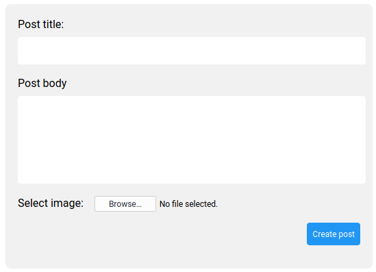

# React Image uploader
This is a simple project that I made to learn about Rails' Active Storage and how to interact with it.

### To download:
* clone repo and cd into it
* run `npm install`
* run `npm start`